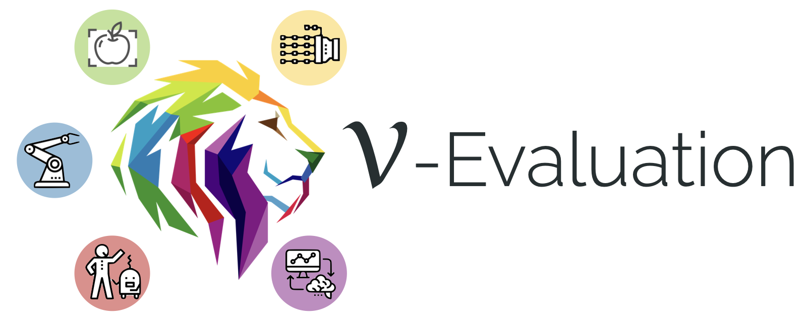

<div align="center">
    
</div>

<div align="center">

[](https://arxiv.org/abs/2302.12766)
[](https://pytorch.org/get-started/previous-versions/#v1120)
[](https://github.com/psf/black)
[](https://github.com/charliermarsh/ruff)


</div>

---

# Evaluation Suite for Robotic Representation Learning

Repository for Voltron Evaluation: A Diverse Evaluation Tasks for Robotic Representation Learning, spanning
Grasp Affordance Prediction, Referring Expression Grounding, Visuomotor Control, and beyond!

---

## Quickstart

This repository is built with PyTorch; while specified as a dependency for the package, we highly recommend that
you install the desired version (e.g., with accelerator support) for your given hardware and environment
manager (e.g., `conda`).

PyTorch installation instructions [can be found here](https://pytorch.org/get-started/locally/). This repository
should work with PyTorch >= 1.12, but has only been thoroughly tested with PyTorch 1.12.0, Torchvision 0.13.0,
Torchaudio 0.12.0.

Once PyTorch has been properly installed, you can install this package locally via an editable installation (this will
install `voltron-robotics` via PyPI if not already on your path):

```bash
git clone https://github.com/siddk/evaluation-dev
cd evaluation-dev
pip install -e .
```

*Note:* Once finalized (and data permissions are cleared) we hope to upload this directly to PyPI for easier setup.

## Usage

V-Evaluation is structured as a series of evaluation applications, each with a semi-unified "harness"; for example,
running the referring expression grounding task (on OCID-Ref) is as simple as:

```python
from voltron import instantiate_extractor, load
import voltron_evaluation as vet

# Load a frozen Voltron (V-Cond) model & configure a MAP extractor
backbone, preprocess = load("v-cond", device="cuda", freeze=True)
map_extractor_fn = instantiate_extractor(backbone)

refer_evaluator = vet.ReferDetectionHarness("v-cond", backbone, preprocess, map_extractor_fn)
refer_evaluator.fit()
refer_evaluator.test()
```

"Vetting" a representation is a modular and straightforward process. Each `harness` takes a backbone, a callable that
defines a new `nn.Module` for representation extraction, and (optionally) a callable defining a task-specific adapter
(if you do not want to use the ones described in the paper). Calling `harness.fit()` will follow the same preprocessing
and training protocols described in the paper, while `harness.test()` will give you the final metrics.

See [`examples/`](/examples) for examples of the other evaluation applications, and `voltron_evaluation/<task>` for
what a task configuration looks like.

---

## Contributing

Before committing to the repository, make sure to set up your dev environment!

Here are the basic development environment setup guidelines:

+ Fork/clone the repository, performing an editable installation. Make sure to install with the development dependencies
  (e.g., `pip install -e ".[dev]"`); this will install `black`, `ruff`, and `pre-commit`.

+ Install `pre-commit` hooks (`pre-commit install`).

+ Branch for the specific feature/issue, issuing PR against the upstream repository for review.

Additional Contribution Notes:
- This project has migrated to the recommended
  [`pyproject.toml` based configuration for setuptools](https://setuptools.pypa.io/en/latest/userguide/quickstart.html).
  However, as some tools haven't yet adopted [PEP 660](https://peps.python.org/pep-0660/), we provide a
  [`setup.py` file](https://setuptools.pypa.io/en/latest/userguide/pyproject_config.html).

- This package follows the [`flat-layout` structure](https://setuptools.pypa.io/en/latest/userguide/package_discovery.html#flat-layout)
  described in `setuptools`.

- Make sure to add any new dependencies to the `project.toml` file!

---

## Repository Structure

High-level overview of repository/project file-tree:

+ `docs/` - Package documentation & assets - including project roadmap.
+ `voltron_evaluation` - Package source; has core utilities for task specification, data loading, preprocessing,
                         defining per-task adapter heads, and fitting/reporting metrics.
+ `examples/` - Standalone example scripts demonstrating various evaluation pipelines.
+ `.pre-commit-config.yaml` - Pre-commit configuration file (sane defaults + `black` + `ruff`).
+ `LICENSE` - Code is made available under the MIT License.
+ `Makefile` - Top-level Makefile (by default, supports linting - checking & auto-fix); extend as needed.
+ `pyproject.toml` - Following PEP 621, this file has all project configuration details (including dependencies), as
                     well as tool configurations (for `black` and `ruff`).
+ `README.md` - You are here!

---

## Citation

Please cite [our paper](https://arxiv.org/abs/2302.12766) if using any of the Voltron models, evaluation suite, or other parts of our framework in your work.

```bibtex
@inproceedings{karamcheti2023voltron,
  title={Language-Driven Representation Learning for Robotics},
  author={Siddharth Karamcheti and Suraj Nair and Annie S. Chen and Thomas Kollar and Chelsea Finn and Dorsa Sadigh and Percy Liang},
  booktitle={Robotics: Science and Systems (RSS)},
  year={2023}
}
```
